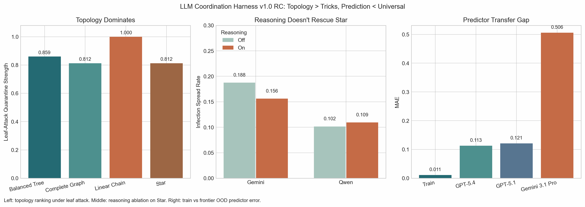
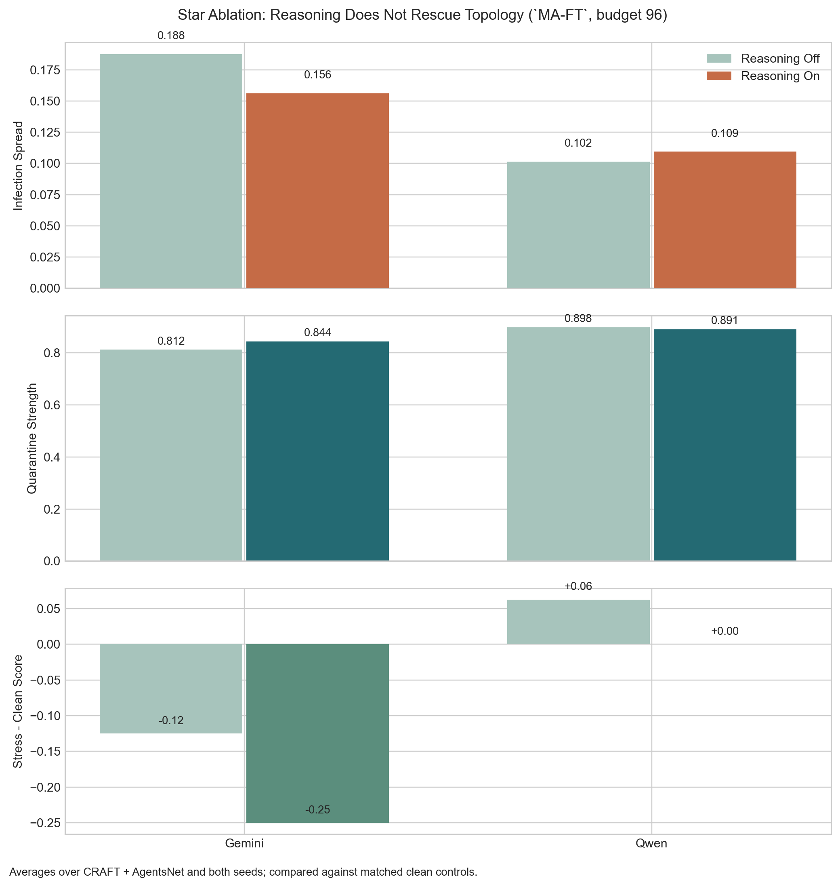
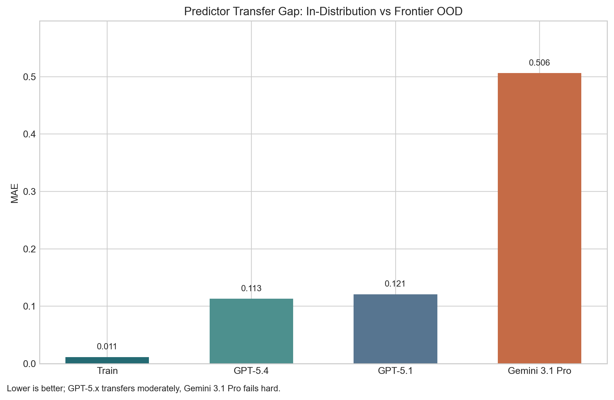
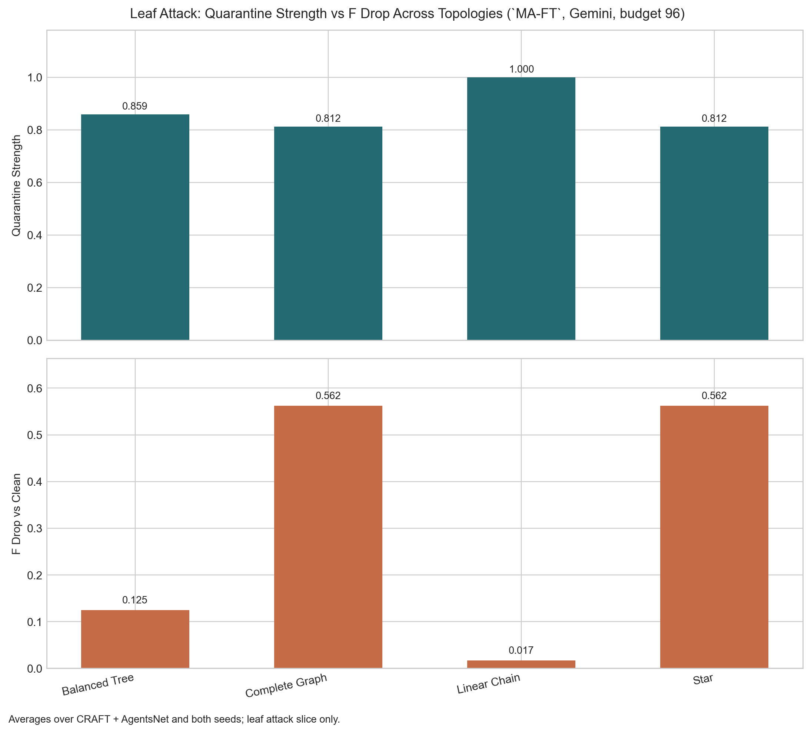
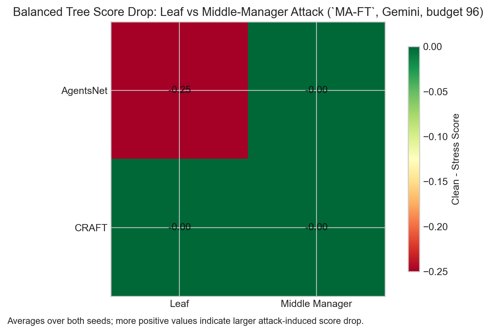
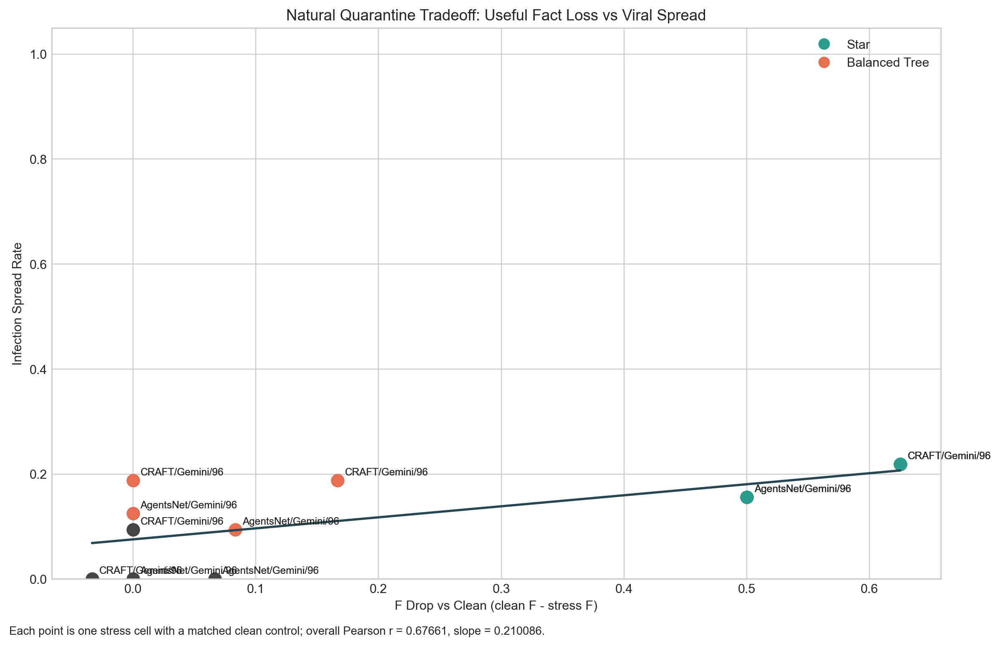
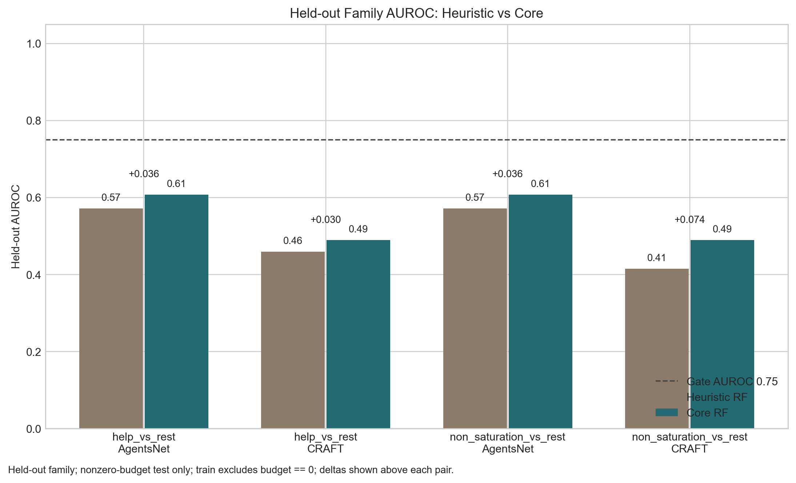

# LLM Coordination Harness

`llm-coordination-harness` is a reproducible research rig for measuring vulnerability in multi-agent LLM systems under fixed billed-token budgets.

## 10-Second Read

- `linear_chain` and `balanced_tree` are consistently safer than `star`
- prompt-level reasoning does not rescue `star`
- a clean-metrics predictor fits seen models well, transfers moderately to `GPT-5.x`, and fails hard on `Gemini 3.1 Pro`

The repo is intentionally positioned as:

- an eval / measurement artifact
- a topology-and-communication research harness
- a methods project with honest negative and mixed-transfer results

It is not positioned as:

- a generic swarm framework
- a production orchestration layer
- proof that a universal coordination law has already been established

## What It Measures

The harness extracts and logs four clean coordination variables:

- `F`: critical-fact survival fidelity through the graph
- `rho`: shared-error correlation under no communication
- `B`: propagation balance over edge fact-survival ratios
- `C`: fan-in pressure from incoming peer-token load vs quota

Stress runs add:

- `infection_spread_rate`
- `attack_success_rate`
- `quarantine_strength`
- matched clean-vs-stress deltas such as `F_delta_vs_clean`

The important property is that these variables are recomputed from artifacts offline rather than existing only in memory.

## Current State

The repository has progressed from early clean/stress calibration to a `v1.0.0 RC` vulnerability-prediction workflow.

Milestone documents:

- [V0.3.0_DRAFT.md](./docs/V0.3.0_DRAFT.md)
- [V0.4.0_DRAFT.md](./docs/V0.4.0_DRAFT.md)
- [V1.0.0_RELEASE_NOTES.md](./docs/V1.0.0_RELEASE_NOTES.md)

Latest result in one sentence:

topology still dominates, reasoning does not rescue `Star`, and a clean-metrics predictor works well in-distribution but is not yet universal on frontier models.

## Headline Results

### Topology Zoo (`v0.3.0`)

Primary artifacts:

- [p0a-topologies-control-live](./outputs/p0a-topologies-control-live)
- [p0b-stress-topologies-live](./outputs/p0b-stress-topologies-live)
- [attack_analysis_report.json](./outputs/p0b-stress-topologies-live/attack_analysis_report.json)

Main outcome:

- `linear_chain` is the safest topology in the current rooted-fusion harness
- `balanced_tree` is better than `star`
- `complete_graph` collapses toward star-like behavior under this protocol
- the strong version of "natural quarantine by degradation" is not supported

### Reasoning And Model Sweeps (`v0.4.0`)

Primary artifacts:

- [v0-4-0-ablation-sweep](./outputs/v0-4-0-ablation-sweep)
- [v0-4-0-gemma-scale](./outputs/v0-4-0-gemma-scale)
- [v0-4-0-boss-fight](./outputs/v0-4-0-boss-fight)
- [V0.4.0_DRAFT.md](./docs/V0.4.0_DRAFT.md)

Main outcome:

- prompt-level reasoning does not fix the structural weakness of `Star`
- `Gemma 4` is strong on robust topologies, especially `linear_chain`
- `GLM 5V Turbo` is not a decisive robustness breakthrough on `Star`
- `Qwen` without reasoning remains one of the strongest `Star` baselines in this repo

### Vulnerability Predictor (`v1.0.0 RC`)

Primary artifacts:

- [vulnerability_predictor_report.json](./outputs/v1-0-0-vulnerability-predictor/vulnerability_predictor_report.json)
- [vulnerability_predictor.cbm](./outputs/v1-0-0-vulnerability-predictor/vulnerability_predictor.cbm)
- [V1.0.0_RELEASE_NOTES.md](./docs/V1.0.0_RELEASE_NOTES.md)

Main outcome:

- `CatBoostRegressor` predicts `infection_spread_rate` from clean metrics with train MAE `0.011333`
- feature importance is dominated by `C`, then `B`, then `enable_reasoning`, then `F`
- frontier transfer is mixed:
  - `GPT-5.4` OOD MAE: `0.11304`
  - `GPT-5.1` OOD MAE: `0.120872`
  - `Gemini 3.1 Pro Preview` OOD MAE: `0.506112`

This is a useful predictor prototype, but not a universal law yet.

## Visuals

Release hero:

Reasoning ablation on `Star`:

Predictor train-vs-frontier transfer gap:

Leaf-attack topology comparison:

Balanced tree leaf vs middle-manager attack:

Useful-fact loss vs infection spread:

Legacy clean predictor hold-out figure:

## Research Position

The strongest supported claims right now are:

- topology matters more than simply choosing a stronger model
- `C` is the dominant empirical vulnerability feature in the current dataset
- frontier models can deviate sharply from in-distribution expectations

The strongest unsupported claim is:

- that a model-agnostic universal vulnerability law has already been proved

## OpenRouter Discipline

Research runs use `research_strict`:

- exact model pinning
- explicit provider pinning
- no `openrouter/auto`
- no provider fallback
- route / pricing / snapshot logging

## Repository Map

Core code:

- [src/coord_harness/core](./src/coord_harness/core)
- [src/coord_harness/attacks](./src/coord_harness/attacks)
- [src/coord_harness/runner](./src/coord_harness/runner)
- [src/coord_harness/evaluation](./src/coord_harness/evaluation)
- [src/coord_harness/analysis](./src/coord_harness/analysis)

Configs:

- [configs](./configs)

Docs:

- [BENCH_SPEC.md](./docs/BENCH_SPEC.md)
- [LOG_SCHEMA.md](./docs/LOG_SCHEMA.md)
- [RUNBOOK.md](./docs/RUNBOOK.md)
- [V0.3.0_DRAFT.md](./docs/V0.3.0_DRAFT.md)
- [V0.4.0_DRAFT.md](./docs/V0.4.0_DRAFT.md)
- [V1.0.0_RELEASE_NOTES.md](./docs/V1.0.0_RELEASE_NOTES.md)

## Where To Start

If you want the shortest path through the repo:

1. Read [V1.0.0_RELEASE_NOTES.md](./docs/V1.0.0_RELEASE_NOTES.md)
2. Read [RUNBOOK.md](./docs/RUNBOOK.md)
3. Inspect [vulnerability_predictor_report.json](./outputs/v1-0-0-vulnerability-predictor/vulnerability_predictor_report.json)
4. Inspect the topology/stress artifacts in [outputs](./outputs)
