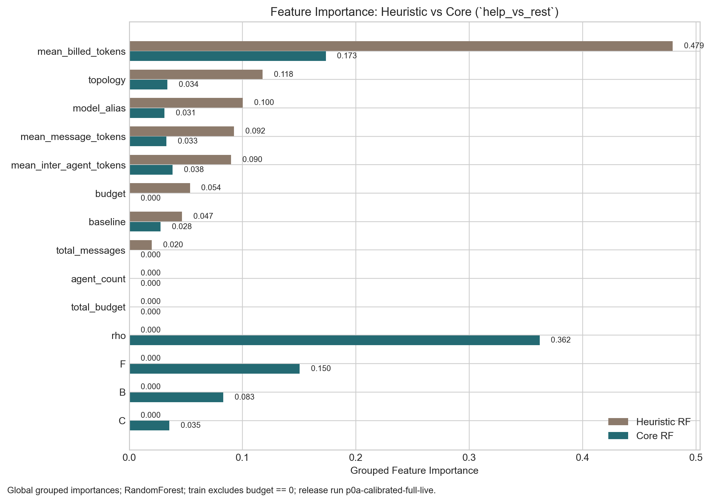
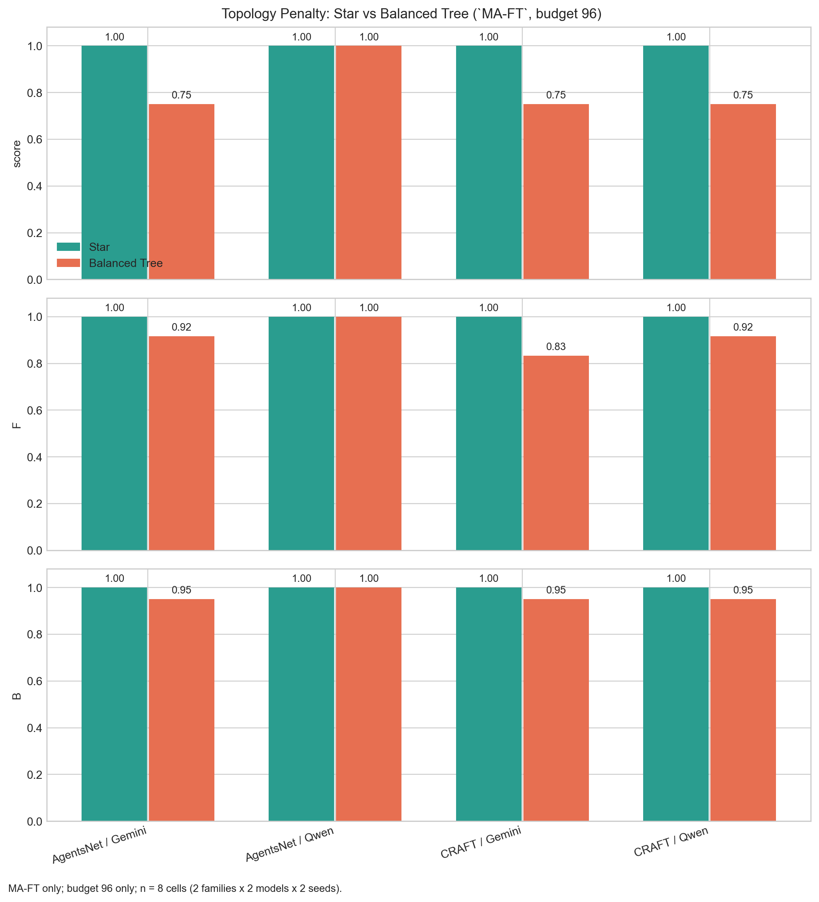
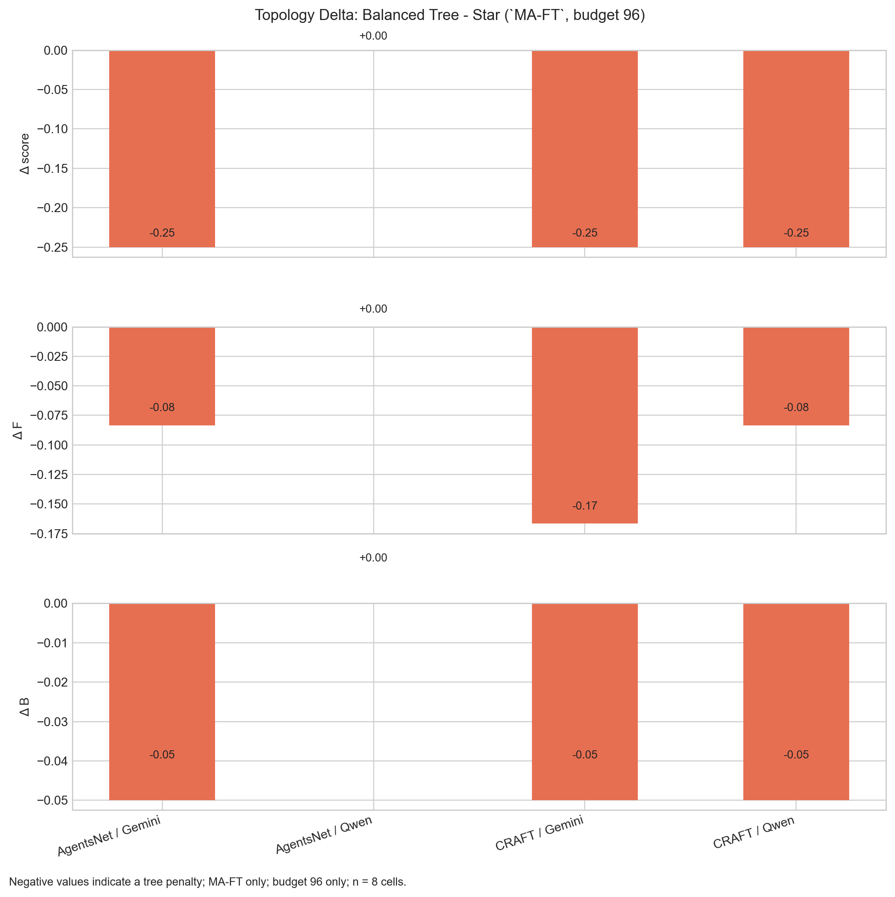
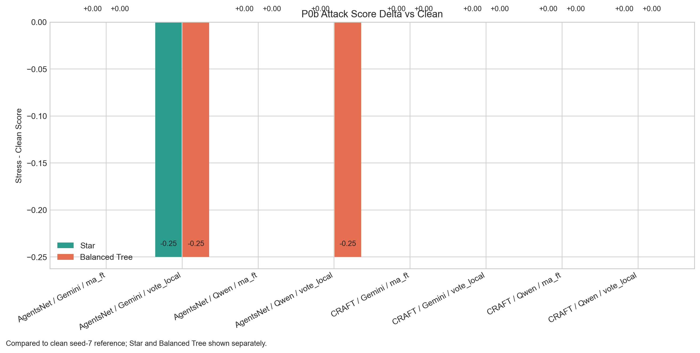
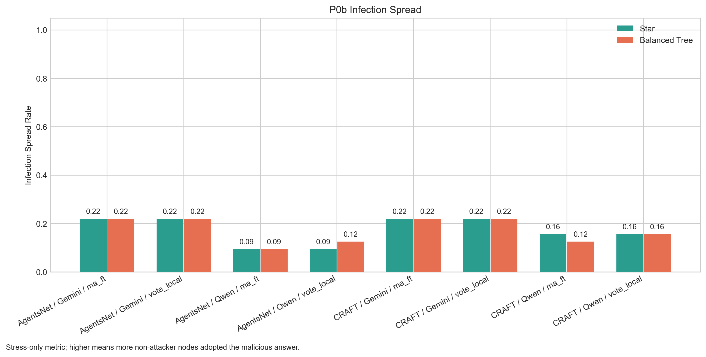
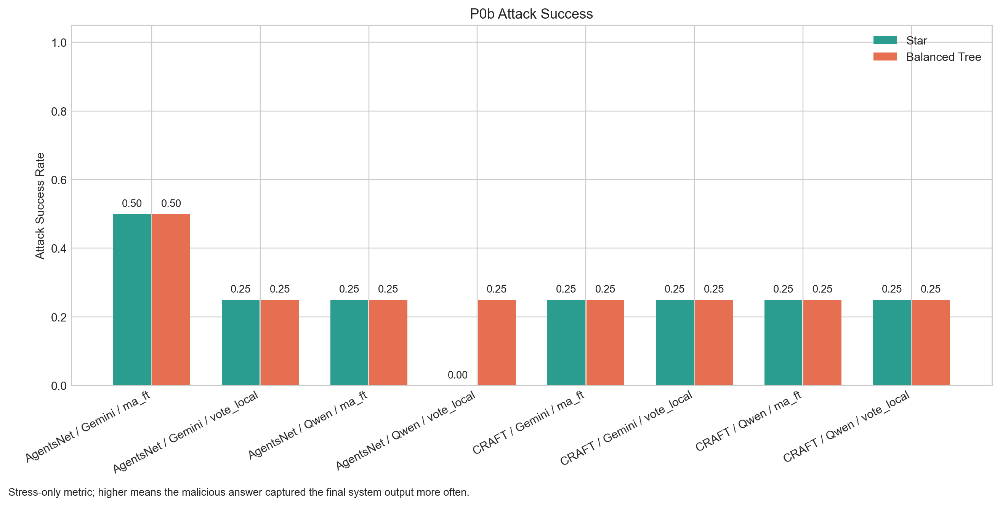

# coord_harness

`coord_harness` is a reproducible measurement rig for hidden coordination variables in multi-agent LLM systems under fixed billed-token budgets.

This repository is intentionally positioned as:

- an eval / harness project
- a measurement-first research artifact
- a negative-results / methods result

This repository is not positioned as:

- a generic swarm framework
- a production routing layer
- a claim that a universal coordination law has already been proved

## What It Measures

The harness extracts and logs:

- `F`: critical-fact survival fidelity through the graph
- `rho`: shared-error correlation under no communication
- `B`: propagation balance over edge fact-survival ratios
- `C`: fan-in pressure from incoming peer-token load vs quota

The important property is that these variables are recomputed from logs offline, rather than living only in process memory.

## Golden Artifacts

The `outputs/` directory is intentionally frozen to the two gold runs:

- [p0a-calibrated-full-live](./outputs/p0a-calibrated-full-live)
- [p0b-attacks-live](./outputs/p0b-attacks-live)

Frozen configs:

- [p0a_calibrated_full_live.yaml](./configs/p0a_calibrated_full_live.yaml)
- [p0b_attacks_live.yaml](./configs/p0b_attacks_live.yaml)
- [RELEASE_FREEZE.json](./configs/RELEASE_FREEZE.json)

## Visuals

Feature importance from the offline predictor analysis:

Topology penalty on `MA-FT` at budget `96`:

Topology delta (`Balanced Tree - Star`) on `MA-FT` at budget `96`:

Held-out predictor AUROC after excluding `budget == 0` from training:

P0b attack score delta vs clean baseline:

P0b infection spread:

P0b attack success rate:

## Headline Results

### Clean Phase (P0a)

The calibrated clean run is here:

- [batch_index.json](./outputs/p0a-calibrated-full-live/batch_index.json)
- [gate_report.json](./outputs/p0a-calibrated-full-live/gate_report.json)
- [predictor_analysis.json](./outputs/p0a-calibrated-full-live/predictor_analysis.json)

Main outcome:

- topology-sensitive coordination failures are real
- repaired `F` and `B` move with those failures
- the current v1 held-out predictor still does **not** pass the clean gate

This is a valid scientific result.

### Stress Phase (P0b)

The attack run is here:

- [batch_index.json](./outputs/p0b-attacks-live/batch_index.json)

Main outcome:

- attack spread is measurable
- star can behave as a zero-quarantine topology
- structures that degrade useful coordination may also weakly attenuate malicious propagation

This is mechanistically interesting, but still not enough to claim a general attack-robustness law.

## Why This Repo Matters

The core question is:

At fixed orchestration and fixed billed budget, do `F`, `rho`, `B`, `C` explain transitions between:

- `help`
- `saturation`
- `collapse`

better than heuristic predictors that mostly exploit size and token-count shortcuts?

The current answer is nuanced:

- the measurement system works
- the hidden coordination variables are real and mechanistically meaningful
- the predictor still fails the intended clean gate

That combination of positive measurement result and negative claim result is exactly the kind of outcome this repo is meant to preserve.

## OpenRouter Discipline

Two modes exist:

- `research_strict`
- `dev_convenience`

Research runs require:

- exact model pinning
- explicit provider pinning
- no `openrouter/auto`
- no provider fallback
- route / pricing / snapshot logging

## Where To Start

- [CLAIM.md](./docs/CLAIM.md)
- [BENCH_SPEC.md](./docs/BENCH_SPEC.md)
- [LOG_SCHEMA.md](./docs/LOG_SCHEMA.md)
- [RUNBOOK.md](./docs/RUNBOOK.md)
- [TECHNICAL_REPORT_DRAFT.md](./docs/TECHNICAL_REPORT_DRAFT.md)
